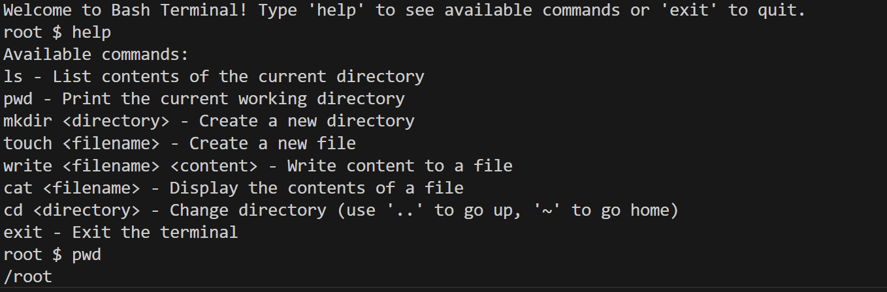

# TernaryTreeDirectory

## Description

TernaryTreeDirectory is a command-line interface program designed to simulate a file explorer tree, providing users with an interactive way to practice working with directories and files. The program supports various basic commands such as ls, pwd, mkdir, touch, write, cat, and cd. It mimics the functionality of a real file system while demonstrating the data structure concept of ternary trees.

## Table of Contents (Optional)

- [Description](#description)
- [Installation](#installation)
- [Usage](#usage)
- [Credits](#credits)
- [License](#license)
- [Badges](#badges)
- [Features](#features)
- [Contribute](#how-to-contribute)
- [Video](#video)

## Installation

To set up the project, follow these steps:

Download and install the Java Development Kit (JDK).

Install the official Java extension for Visual Studio Code (VSCode).

## Usage

To start using TernaryTreeDirectory, run the program in your terminal and use the available commands to navigate and manipulate the simulated file system.

## Credits

This project was developed independently and has no collaborators.

## License

This project currently does not have a license. Feel free to use and modify it as needed.

## Badges

## Features

Basic File System Commands: Supports commands such as:

pwd: Displays the current directory path.

ls: Lists files and directories in the current directory.

mkdir: Creates a new directory.

touch: Creates a new file.

write: Writes content to a file.

cat: Displays the content of a file.

cd: Changes the current directory.

Ternary Tree Structure: Simulates a ternary tree for managing directories and files, offering a unique learning opportunity for data structures enthusiasts.

## How to Contribute

If you'd like to contribute:

Fork this repository.

Clone the forked repository to your local machine.

Create a new branch for your feature or fix.

Commit your changes and push them to your branch.

Open a pull request to submit your contributions.

## Tests

To run tests, create a tests folder and use the following command: npm test

## Video

https://youtu.be/-WQPwI1RrhU
